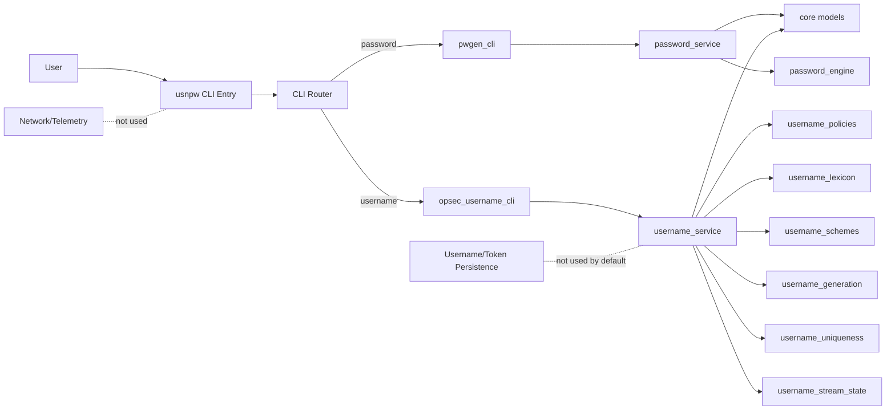

# Architecture

USnPw is a local-only CLI system with strict service boundaries.
The architecture intentionally favors auditability over abstraction depth.

## Architecture View

## Runtime Flow
1. CLI parses args and builds typed request models.
2. Service layer validates input and enforces policy defaults/fail-closed behavior.
3. Core generation modules produce outputs entirely in-process.
4. CLI prints results and exits with no background services.

## Entrypoints
| Path | Role |
|---|---|
| `usnpw` | Installed CLI command |
| `usnpw/cli/usnpw_cli.py` | Unified CLI router |

## CLI Layer
| Path | Role |
|---|---|
| `usnpw/cli/usnpw_cli.py` | Subcommand router (`password`, `username`) |
| `usnpw/cli/pwgen_cli.py` | Password argument parsing |
| `usnpw/cli/opsec_username_cli.py` | Username argument parsing |

## Service Layer
| Path | Role |
|---|---|
| `usnpw/core/password_service.py` | Password request validation and orchestration |
| `usnpw/core/username_service.py` | In-memory, stream-only username orchestration |
| `usnpw/core/models.py` | Typed request/response contracts |

## Generation Primitives
| Path | Role |
|---|---|
| `usnpw/core/password_engine.py` | Secret generation primitives |
| `usnpw/core/username_generation.py` | Candidate generation and stream tagging |
| `usnpw/core/username_lexicon.py` | Token pools and run subsets |
| `usnpw/core/username_schemes.py` | Scheme definitions and balancing |
| `usnpw/core/username_policies.py` | Platform normalization policies |
| `usnpw/core/username_uniqueness.py` | Token extraction and repeat checks |
| `usnpw/core/username_stream_state.py` | Stateless stream tag derivation helpers |

## Editorial Style
Use this writing style when editing architecture docs.

1. Lead with boundaries first, not implementation trivia.
2. Use active voice and present tense.
3. Prefer short claims that are testable in code.
4. State security/privacy intent when describing behavior.
5. Use path-based references for every architectural claim.
6. Separate stable design from evolving implementation details.
7. Keep diagrams synchronized with module boundaries after refactors.

## Explicitly Removed
- API server surface
- GUI surface
- container distribution files
- username/token persistence ledgers
- stream-state persistence files and locking pathways
